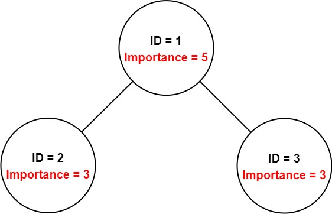
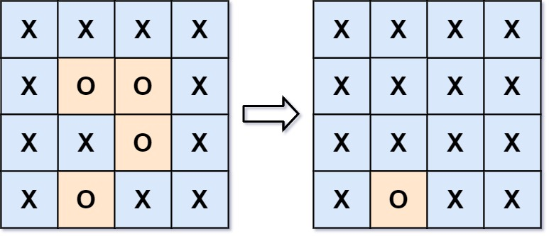

# BFS专题笔记(2021.6.6-2021.6.10)

# 前言

今天是开始刷leetcode以来刷到的第三个专题啦，这一周广州都在下雨，鞋子湿了很难受。

和前面的DFS专题相似，BFS也常用在树、图的遍历和搜索上面。

最近也发现了一个很不错的图论网课，链接：https://youtu.be/09_LlHjoEiY

# Leetcode题目编号

- #127 Word Ladder
- #994 Rotting Oranges
- #417 Pacific Atlantic Water Flow
- #1091 Shortest Path in Binary Matrix
- #690 Employee Importance
- #787 Cheapest Flights Within K Stops
- #279 Perfect Squares
- #542 01 Matrix
- #130 Surrounded Regions
- #993 Cousins in Binary Tree

# 数据结构

## 基本遍历

BFS在进行遍历的时候，有点像水波纹一样逐层散开，因此BFS在解决朋友圈问题，或者求最短路径问题时都可以进行使用。

BFS在遍历时需要使用数组作为其辅助数据结构记录结下来遍历节点的节点编号，同时在图的遍历中同样需要使用visited节点或者修改节点的标识位（见#130 Surrounded Regions）来标识已经遍历过的节点防止陷入死循环。

（事实上我更喜欢BFS胜于DFS，BFS在迭代的时候更为直观，而且Python的collections.deque()方法可以很方便的的构造队列）

```python
def BFS(node):
  queue = collections.deque()
  queue.append(node)
  while queue:	#basecase
    node = queue.leftpop()
    node.data
    queue.append(node.lchild)
    queue.append(node.rchild)
```


## 拓展

一般来说，我们基础的节点遍历需求可能是从根节点遍历，并返回节点顺序。

在部分题目中我们的BFS可能回比较tricky，如：在#417 Pacific Atlantic Water Flow和#130 Surrounded Regions中，我们并不是从根节点开始遍历（因为这样的时间复杂度太高了），而是巧妙地从边界（可以理解为叶子节点）开始遍历，并通过visited数组（#417）或者对数据中标志位进行修改（#130）的方式来寻找所有符合要求的节点（根节点），这样做可以从一定程度上降低程序的运行时间，优化运行效率。

# 题解

需要注意的是，题解依旧是不会与上面的LC题目编号顺序一一对应。

## [#690. Employee Importance](https://leetcode-cn.com/problems/employee-importance/)

You have a data structure of employee information, which includes the employee's unique id, their importance value, and their direct subordinates' id.

You are given an array of employees employees where:

- employees[i].id is the ID of the ith employee.
- employees[i].importance is the importance value of the ith employee.
- employees[i].subordinates is a list of the IDs of the subordinates of the ith employee.

Given an integer id that represents the ID of an employee, return the total importance value of this employee and all their subordinates.

Example 1:



```
Input: employees = [[1,5,[2,3]],[2,3,[]],[3,3,[]]], id = 1
Output: 11
Explanation: Employee 1 has importance value 5, and he has two direct subordinates: employee 2 and employee 3.
They both have importance value 3.
So the total importance value of employee 1 is 5 + 3 + 3 = 11.`
```

### 思路

本题中，我们要返回给定节点的importance和该节点下所有孩子的importance之和。

在刚刚开始的时候，我以为要预先BFS遍历该节点来构建树。在自习观察input之后，发现每一个节点下面都直接标识他的孩子节点：即使目标节点不是树的根节点，我们也可以直接从该节点开始遍历。

在遍历之前，我们新建一个结果变量res来存储结果，并将每个遍历到节点的importance都加到res中，最后返回res即可。

### 代码

```python
class Solution:  # BFS
    def getImportance(self, employees: List['Employee'], idx: int) -> int:
        hash_map = {employee.id: employee for employee in employees}

        queue = collections.deque()
        queue.append(idx) # deque中元素要iterable
        # 两种写法：
        # queue = collections.deque([idx]) # 要死直接生成deque必须传入iterable
        # or
        # queue = collections.deque()
        # queue.append(idx) # append可以直接append int
        sum_importance = 0
        while queue:
            employee_idx = queue.popleft()
            employee = hash_map[employee_idx]
            sum_importance += employee.importance
            queue.append(sub_employee for sub_employee in employee.subordinates)

        return sum_importance
```

同时顺便附上本问题的DFS写法：

```python
class Solution:  # DFS
    def getImportance(self, employees: List['Employee'], idx: int) -> int:
        hash_map = {employee.id: employee for employee in employees}  # 创建哈希表

        def dfs(idx: int) -> int:
            employee = hash_map[idx]
            total = employee.importance + sum(dfs(subIdx) for subIdx in employee.subordinates)  # 递归
            return total

        return dfs(idx)
```

## [#993. Cousins in Binary Tree](https://leetcode-cn.com/problems/cousins-in-binary-tree/)

In a binary tree, the root node is at depth 0, and children of each depth k node are at depth k+1.

**Two nodes of a binary tree are cousins if they have the same depth, but have different parents.**

We are given the root of a binary tree with unique values, and the values x and y of two different nodes in the tree.

Return true if and only if the nodes corresponding to the values x and y are cousins.

**Example 2:**


```
Input: root = [1,2,3,null,4,null,5], x = 5, y = 4
Output: true
```

### 思路

这题题目要我们求指定的x, y节点是否是cousin节点，并返回布尔值。

从题目中我们可以得知，判定两节点是否是cousin节点的条件是：两节点深度相同，但是父节点不同。从这个条件出发，我们在队列中同时维护节点的深度与他们的父节点。当找到x, y节点的时候，比对其深度和父节点，就可以得到结果了。

### 代码

```python
class Solution:
    def isCousins(self, root: TreeNode, x: int, y: int) -> bool:
        """
        判定两个节点是cousin节点的重要条件是：
        1. 具有相同的深度
        2. 他们的父节点不同
        因此我们对树进行常规的BFS，同时在BFS过程中维护叶子节点的深度以及其父节点即可
        :param root:
        :param x:
        :param y:
        :return:
        """
        queue = collections.deque()
        # queue: (node, depth, parents)
        queue.append((root, 0, None))
        res_x, res_y = None, None
        while queue:
            node, depth, parents = queue.popleft()  # 节点出栈
            if node.val == x:  # 找到X
                res_x = (depth, parents)
            if node.val == y:  # 找到Y
                res_y = (depth, parents)
            if res_x and res_y is not None and \
                    res_x[1] == res_y[1] and \
                    res_x[2] != res_y[2]:
                # 判断是否是cousin节点：depth相同，parent不同
                return True
            if node.left is not None:
                queue.append((node.left, depth + 1, node.val))
            if node.right is not None:
                queue.append((node.right, depth + 1, node.val))
```

最后附上官方的代码，优化了一下：

```python
class Solution:
    def isCousins(self, root: TreeNode, x: int, y: int) -> bool:
        # x 的信息
        x_parent, x_depth, x_found = None, None, False
        # y 的信息
        y_parent, y_depth, y_found = None, None, False
        
        # 用来判断是否遍历到 x 或 y 的辅助函数
        def update(node: TreeNode, parent: TreeNode, depth: int):
            if node.val == x:
                nonlocal x_parent, x_depth, x_found
                x_parent, x_depth, x_found = parent, depth, True
            elif node.val == y:
                nonlocal y_parent, y_depth, y_found
                y_parent, y_depth, y_found = parent, depth, True

        q = collections.deque([(root, 0)])
        update(root, None, 0)

        while q:
            node, depth = q.popleft()
            if node.left:
                q.append((node.left, depth + 1))
                update(node.left, node, depth + 1)
            if node.right:
                q.append((node.right, depth + 1))
                update(node.right, node, depth + 1)
            
            if x_found and y_found:
                break

        return x_depth == y_depth and x_parent != y_parent
```


## [#542. 01 Matrix](https://leetcode-cn.com/problems/01-matrix/)

Given an m x n binary matrix mat, return the distance of the nearest 0 for each cell.

The distance between two adjacent cells is 1.

Example 1:


```
Input: mat = [[0,0,0],[0,1,0],[0,0,0]]
Output: [[0,0,0],[0,1,0],[0,0,0]]
```

### 思路

本题目给定一个矩阵求每一个节点附近最近的0的距离。需要注意的是，如果节点本身就是"0"，那么到最近的"0"（他自己）的距离就是0，因此我们在遇到数值为"0"的节点时可以提前剪枝提高效率。

对于数值不为0的节点，我们以它为开头进行BFS。在BFS中，在每一次while循环中入队的邻居节点与开始的节点的距离都是相同的（可以形象的把它理解为水波扩散的方式）。在遍历节点的同时，我们维护一个distance变量用来表示当前节点与头节点的距离，当遍历到节点数值为"0"的节点时就可以直接返回了。

**TIPS: 在BFS中，后遍历到的节点距离头节点的距离一定大于先遍历到的节点（队列的FIFO特性）**

### 代码

```python
class Solution:
    def updateMatrix(self, mat: List[List[int]]) -> List[List[int]]:
        def neighbours(cur_x, cur_y, visited):
            for ne_x, ne_y in [(cur_x + 1, cur_y), (cur_x - 1, cur_y), (cur_x, cur_y + 1), (cur_x, cur_y - 1)]:
                if 0 <= ne_x < len(mat) and 0 <= ne_y < len(mat[0]) and \
                        (ne_x, ne_y) not in visited:
                    yield ne_x, ne_y

        def bfs(x, y):
            queue = collections.deque()
            queue.append((x, y, 0))
            visited = set()
            visited.add((x, y))

            while queue:
                cur_x, cur_y, cnt = queue.popleft()
                if mat[cur_x][cur_y] == 0:
                    res[x][y] = cnt
                    break   # 提前剪枝，由队列的FIFO特性可知该节点就是离头节点最近的0节点
                for ne_x, ne_y in neighbours(cur_x, cur_y, visited):
                    queue.append((ne_x, ne_y, cnt + 1)) # 邻居节点的距离比当前节点多一
                    visited.add((ne_x, ne_y))

        import numpy
        res = []
        for row in range(len(mat)):
            res.append([0] * len(mat[0]))  # 创建一个和mat相同维度的数组
        for x in range(len(mat)):
            for y in range(len(mat[0])):
                if mat[x][y] == 0:
                    res[x][y] = 0  # 如果是0则距离直接为0
                else:
                    bfs(x, y)  # 否则进行BFS寻找最近的0
        return res
```

## [#1091. Shortest Path in Binary Matrix](https://leetcode-cn.com/problems/shortest-path-in-binary-matrix/)

Given an n x n binary matrix grid, return the length of the shortest clear path in the matrix. If there is no clear path, return -1.

A clear path in a binary matrix is a path from the top-left cell (i.e., (0, 0)) to the bottom-right cell (i.e., (n - 1, n - 1)) such that:

All the visited cells of the path are 0.
All the adjacent cells of the path are 8-directionally connected (i.e., they are different and they share an edge or a corner).
The length of a clear path is the number of visited cells of this path.

**Example 1:**


```
Input: grid = [[0,1],[1,0]]
Output: 2
```

### 思路

本题的思路是正常图的BFS，但是又有那么一点点不一样，主要体现在：

1. 邻居节点方向为8向。
2. 在BFS遍历过程中需要统计步数。这一点可以参考#542，在队列中维护步数即可。

### 代码

```python
class Solution:
    def shortestPathBinaryMatrix(self, grid: List[List[int]]) -> int:
        """
        单向BFS
        :param grid:
        :return:
        """

        def neighbours(node):
            x, y = node
            for nx, ny in [(x + 1, y), (x - 1, y), (x, y + 1), (x, y - 1), (x + 1, y + 1), (x + 1, y - 1),
                           (x - 1, y + 1), (x - 1, y - 1)]:
                if 0 <= nx < len(grid) and 0 <= ny < len(grid[0]) and \
                        grid[nx][ny] == 0:
                    yield nx, ny

        n = len(grid)   # 题目中给定矩阵是方阵
        start = (0, 0)
        end = (n - 1, n - 1)

        if grid[start[0]][start[1]] or grid[end[0]][end[1]] == 1:  # 判断开始非法情况
            return -1

        step = 1  # 开始时已经算第一步
        queue = collections.deque()
        queue.append((start, step))

        while queue:
            # BFS
            cur_node, step = queue.popleft()
            if cur_node == end:  # 当检测到达终点的时候停止
                return step
            for nx, ny in neighbours(cur_node):
                queue.append(((nx, ny), step + 1))
                grid[nx][ny] = -1
        return -1  # 尝试所有方式后无法到达
```


## [#994. Rotting Oranges](https://leetcode-cn.com/problems/rotting-oranges/)

You are given an m x n grid where each cell can have one of three values:

0 representing an empty cell,
1 representing a fresh orange, or
2 representing a rotten orange.
Every minute, any fresh orange that is 4-directionally adjacent to a rotten orange becomes rotten.

Return the minimum number of minutes that must elapse until no cell has a fresh orange. If this is impossible, return -1.

**Example 1:**


```
Input: grid = [[2,1,1],[1,1,0],[0,1,1]]
Output: 4
```

### 思路

本题是很明显的BFS问题。需要注意的是，腐烂的橘子可能不止一个，因此我们需要对初始状态下所有腐烂的橘子同时进行BFS。虽然说是要同时进行BFS，但是我们并不需要在while中在嵌套一个for循环进行遍历，只需要在队列的元素中同时维护一个timestamp变量记录遍历到该节点所需的时间即可。

在遍历完成后，我们在检查是否还有孤立的节点没有被遍历，如果有则返回-1（说明有橘子无法腐烂），如果没有则返回最后一个节点的timestamp即为最大经过的时间（队列的FIFO特性，最后一个出队的节点一定离头节点最远）。

### 代码

```python
class Solution:
    def orangesRotting(self, grid: list) -> int:
        """
        观察到对于所有的腐烂橘子，其实它们在广度优先搜索上是等价于同一层的节点的。
        因此我们使用timestamp来标记同一层腐烂的橘子，并同时对他们进行BFS
        :param grid:
        :return:
        """

        def neighbour(x, y):
            for r, c in [
                (x + 1, y),
                (x - 1, y),
                (x, y + 1),
                (x, y - 1)
            ]:
                if 0 <= r < len(grid) and 0 <= c < len(grid[0]):
                    yield r, c

        queue = collections.deque()
        timestamp = 0
        for x in range(len(grid)):
            for y in range(len(grid[0])):
                if grid[x][y] == 2:  # 先全部入队再进行遍历，提高效率
                    queue.append((x, y, 0))

        while queue:
            x, y, timestamp = queue.popleft()
            for r, c in neighbour(x, y):
                if grid[r][c] == 1:
                    grid[r][c] = 2
                    queue.append((r, c, timestamp + 1))

        if any(1 in row for row in grid):
            return -1

        return timestamp
```


## [#130. Surrounded Regions](https://leetcode-cn.com/problems/surrounded-regions/)

Given an m x n matrix board containing 'X' and 'O', capture all regions surrounded by 'X'. A region is captured by flipping all 'O's into 'X's in that surrounded region.



```
Input: board = [["X","X","X","X"],["X","O","O","X"],["X","X","O","X"],["X","O","X","X"]]
Output: [["X","X","X","X"],["X","X","X","X"],["X","X","X","X"],["X","O","X","X"]]
Explanation: Surrounded regions should not be on the border, which means that any 'O' on the border of the board are not flipped to 'X'. Any 'O' that is not on the border and it is not connected to an 'O' on the border will be flipped to 'X'. Two cells are connected if they are adjacent cells connected horizontally or vertically.
```

### 思路

这题正向思路应该是for循环遍历所有的点，并对所有的点进行BFS，看是否会遍历到边界节点，如果是则保持正常，否则修改所有的visited节点直到结束。这种方法应对小规模input时候还能用，但是大规模就会容易超时。

比较巧妙的方式是反其道而行之，通过对符合要求的边界节点进行BFS，遍历所有与其相连的节点，并将节点的数据改为"A"（与"O"和"X"作区分）。随后将board内的"O"改为X，将board内的"A"改为"O"即可。

**TIPS：在很多时候我们要对input中的不止一个节点进行BFS，正确的多节点BFS方式应该是将所有需要BFS的节点入队后在运行BFS函数。如果对每一个需要遍历的节点都运行BFS函数的话将使时间耗费在新建队列和queue上面。**

### 代码

```python
class Solution:
    def solve(self, board: List[List[str]]) -> None:
        """
        Do not return anything, modify board in-place instead.
        """
        """
        解题思路：
        题目中提到，只有与边界节点相连的节点才是不被"X"包围的节点
        因此我们从边界节点开始广度有限搜索，搜索所有相邻的节点
        并将这些节点置为"A"，说明这些节点与边界相连。
        最后遍历整个board，对所有不是"A"的节点置"X"（因为这些节点没有与边界节点相连）
        PS. 我们还可以使用visited数组的方式来存储节点（但是runtime稍长）
        执行用时: 60 ms 47%
        内存消耗: 18.3 MB 83%

        """
        def neighbours(cur_x, cur_y):
            for ne_x, ne_y in [(cur_x + 1, cur_y), (cur_x - 1, cur_y), (cur_x, cur_y + 1), (cur_x, cur_y - 1)]:
                if 0 <= ne_x < len(board) and 0 <= ne_y < len(board[0]) and board[ne_x][ne_y] == "O":
                    yield ne_x, ne_y

        queue = collections.deque()
        # visited = set()
        for i in range(len(board)): # 所有边界节点入队
            if board[i][0] == "O":
                queue.append((i, 0))
            if board[i][len(board[0]) - 1] == "O":
                queue.append((i, len(board[0]) - 1))
        for i in range(len(board[0])):
            if board[0][i] == "O":
                queue.append((0, i))
            if board[len(board) - 1][i] == "O":
                queue.append((len(board) - 1, i))

        while queue:    # BFS
            node = queue.popleft()
            if board[node[0]][node[1]] == "O":
                board[node[0]][node[1]] = "A"   # 将与边界相连的节点数值改为A（后面会改回来，这里做标记用）
            for ne_node in neighbours(node[0], node[1]):
                queue.append(ne_node)

        for x in range(len(board)):
            for y in range(len(board[0])):
                if board[x][y] == "A":  # "A": 与边界相连的饿节点
                    board[x][y] = "O"
                else:
                    board[x][y] = "X"   # 不与边界相连的节点置为X
```

## [#417. Pacific Atlantic Water Flow](https://leetcode-cn.com/problems/pacific-atlantic-water-flow/)

There is an m x n rectangular island that borders both the Pacific Ocean and Atlantic Ocean. The Pacific Ocean touches the island's left and top edges, and the Atlantic Ocean touches the island's right and bottom edges.

The island is partitioned into a grid of square cells. You are given an m x n integer matrix heights where heights[r][c] represents the height above sea level of the cell at coordinate (r, c).

The island receives a lot of rain, and the rain water can flow to neighboring cells directly north, south, east, and west if the neighboring cell's height is less than or equal to the current cell's height. Water can flow from any cell adjacent to an ocean into the ocean.

Return a 2D list of grid coordinates result where result[i] = [ri, ci] denotes that rain water can flow from cell (ri, ci) to both the Pacific and Atlantic oceans.

**Example 1:**


```
Input: heights = [[1,2,2,3,5],[3,2,3,4,4],[2,4,5,3,1],[6,7,1,4,5],[5,1,1,2,4]]
Output: [[0,4],[1,3],[1,4],[2,2],[3,0],[3,1],[4,0]]
```

### 思路

本题同样是可以用BFS来解决。

在进行BFS之前，我们首先要判断可以流到Pacific Ocean和Atlantic Ocean的节点坐标特征，从示意图中我们可以很直观的发现这些节点就是矩阵的边界节点。以上图的m x m矩阵为例，Pacific Ocean的节点为$mat[0][k]$和$mat[k][0]$，其中$k\in[0,m)$，Atlantic Ocean同理，这里就不再赘述了。

在解决了节点坐标判定的问题之后，我们就可以对这些节点进行BFS了。

直观的来说我们使用正向BFS，使用两个for循环遍历mat的每一个节点，并使用BFS判断该节点能否流到Pacific和Atlantic。但正如前面所说，这种方法的时间复杂度很大，在面对规模大的input的时候会直接超时。

因此我们同样反其道而行之，分别从Pacific和Atlantic的边界节点出发，通过BFS找到水可以逆流流到的所有节点（在这里我们就假设水往高处流吧），在BFS结束之后返回visited集合。通过取两个visited集合的交集，我们就可以得出水同时可以流到Pacific和Atlantic的节点集合了。

### 代码

```python
class Solution:
    def pacificAtlantic(self, heights: List[List[int]]) -> List[List[int]]:
        def BFS(x, y, visited):
            """
            对所有的边界点进行深度优先搜索
            :param x: 头节点x坐标
            :param y: 头节点y坐标
            :param visited: 此处传入visited数组来避免重复生成，优化效率
            :return: 
            """
            queue = collections.deque()
            queue.append((x, y))
            visited.add((x, y))

            def neighbours(node):
                x, y = node
                for neighbour_x, neighbour_y in [(x + 1, y),
                             (x - 1, y),
                             (x, y + 1),
                             (x, y - 1)]:
                    if 0 <= neighbour_x < m and 0 <= neighbour_y < n and \
                            heights[neighbour_x][neighbour_y] >= heights[x][y] and \
                            (neighbour_x, neighbour_y) not in visited:
                        # 检查越界、检查大小、检查是否遍历
                        # 水往高处流
                        yield neighbour_x, neighbour_y

            while queue:
                node = queue.popleft()
                for neighbour_node in neighbours(node):
                    queue.append(neighbour_node)
                    visited.add(neighbour_node)

        m, n = len(heights), len(heights[0])
        visited_pacific = set()
        visited_atlantic = set()
        for x in range(m):
            # todo 将元素全部入队后一次性进行BFS可以优化效率
            BFS(x, 0, visited_pacific)
            BFS(x, n - 1, visited_atlantic)
        for y in range(n):
            BFS(0, y, visited_pacific)
            BFS(m - 1, y, visited_atlantic)
        return list(visited_pacific & visited_atlantic)
```

## [#787. Cheapest Flights Within K Stops](https://leetcode-cn.com/problems/cheapest-flights-within-k-stops/)

There are n cities connected by some number of flights. You are given an array flights where flights[i] = [fromi, toi, pricei] indicates that there is a flight from city fromi to city toi with cost pricei.

You are also given three integers src, dst, and k, return the cheapest price from src to dst with at most k stops. If there is no such route, return -1.

**Example 1:**


```
Input: n = 3, flights = [[0,1,100],[1,2,100],[0,2,500]], src = 0, dst = 2, k = 1
Output: 200
Explanation: The graph is shown.
The cheapest price from city 0 to city 2 with at most 1 stop costs 200, as marked red in the picture.
```

### 思路（施工中，在看Dijkstra）

### 代码

```python
class Solution:
    def findCheapestPrice(self, n: int, flights: List[List[int]], src: int, dst: int, k: int) -> int:
        graph = defaultdict(dict)  # 建立二维字典，存储格式是{src1:{dst1:cost1,dst2:cost2...}}
        for u, v, w in flights:
            graph[u][v] = w  # 建立邻接表存储边的信息

        # 建立队列，方便BFS，记录每层搜索的出发节点们，初始为src，第二个元素是记录走到该节点为止的cost
        queue = [(src, 0)]
        # 记录遍历到某节点所需的cost，若有新线路到该节点的花费更少，才把线路放入队列，再从该节点进行下次遍历
        costlist = [float('inf') for _ in range(100)]
        # count记录走了几个节点，res记录走到终点时最小的花费值
        count, res = 0, float('inf')
        # 开始BFS
        while queue and count <= k:
            tempq = []  # 记录下一层的BFS的queue
            for x in queue:  # 遍历这一层的起点
                tempcost = x[1]  # 记录走到该起点时的已有花费
                for y in graph[x[0]]:  # 遍历从该起点可到达的终点
                    costnow = tempcost + graph[x[0]][y]  # 现在的花费
                    if costnow < costlist[y]:  # 若该线路的花费小于之前的线路的花费，才继续往下走
                        costlist[y] = costnow  # 更新该终点的最小花费
                        if y == dst:  # 若到达终点，则更新到达终点的最小花费
                            res = min(costnow, res)
                        else:
                            tempq.append((y, costnow))  # 将该点加入下一次遍历的节点中
            queue = tempq
            count += 1

        if res == float('inf'):  # 说明到不了dst
            return -1
        return res
```


## [#127. Word Ladder](https://leetcode-cn.com/problems/word-ladder/)

A transformation sequence from word beginWord to word endWord using a dictionary wordList is a sequence of words beginWord -> s1 -> s2 -> ... -> sk such that:

- Every adjacent pair of words differs by a single letter.
- Every si for 1 <= i <= k is in wordList. Note that beginWord does not need to be in wordList.
- sk == endWord
Given two words, beginWord and endWord, and a dictionary wordList, return the number of words in the shortest transformation sequence from beginWord to endWord, or 0 if no such sequence exists.

Example 1:
```
Input: beginWord = "hit", endWord = "cog", wordList = ["hot","dot","dog","lot","log","cog"]
Output: 5
Explanation: One shortest transformation sequence is "hit" -> "hot" -> "dot" -> "dog" -> cog", which is 5 words long.
```

### 思路

参考题解：https://leetcode-cn.com/problems/word-ladder/solution/yan-du-you-xian-bian-li-shuang-xiang-yan-du-you-2/

由于这里官方的题解讲得比我好，因此就直接做摘录了：

「转换」意即：两个单词对应位置只有一个字符不同，例如 "hit" 与 "hot"，这种转换是可以逆向的，因此，根据题目给出的单词列表，可以构建出一个无向（无权）图；


如果一开始就构建图，每一个单词都需要和除它以外的另外的单词进行比较，复杂度是$ O(N \rm{wordLen})$，这里 NN 是单词列表的长度；
为此，我们在遍历一开始，把所有的单词列表放进一个哈希表中，然后在遍历的时候构建图，每一次得到在单词列表里可以转换的单词，复杂度是 $O(26 \times \rm{wordLen})$，借助哈希表，找到邻居与 N 无关；
使用 BFS 进行遍历，需要的辅助数据结构是：

- 队列；
- visited 集合。说明：可以直接在 wordSet (由 wordList 放进集合中得到)里做删除。但更好的做法是新开一个哈希表，遍历过的字符串放进哈希表里。这种做法具有普遍意义。绝大多数在线测评系统和应用场景都不会在意空间开销。

基本上，我们的做法是对于每一个单词，尝试替换其中的字母并寻找wordList中是否有匹配，如果有匹配，则将匹配的单词入队，继续进行替换，直到当前单词等于终点单词为止。

需要注意的是，由于单词表长度可能非常长，因此在本题中我们不能使用for循环遍历单词表，否则容易超时。使用哈希表进行查询可以在很大程度上提高我们的效率。

### 代码

```python
class Solution:
    def ladderLength(self, beginWord: str, endWord: str, wordList) -> int:
        """
        BFS
        :param beginWord:
        :param endWord:
        :param wordList:
        :return:
        """
        # basecase
        if endWord not in wordList: # 如果endWord不在wordList中，则无法完成
            return 0

        if beginWord in wordList:   # 将beginWord去除，防止死循环
            wordList.remove(beginWord)

        word_set = set(wordList)

        # 构建BFS的辅助数据结构queue和visited数组
        queue = collections.deque()
        queue.append(beginWord)

        visited = set(beginWord)

        word_len = len(beginWord)   # 注意题目中各个word长度相同
        step = 1    # 在beginWord存在的情况下，至少需要一步
        while queue:
            cur_queue_size = len(queue)
            for i in range(cur_queue_size):
                cur_word = queue.popleft()
                cur_word_ch_list = list(cur_word)

                # 将单词中的每个字母尝试修改，寻找匹配
                for j in range(word_len):  # 所有的单词长度相同
                    origin_word_ch = cur_word_ch_list[j]  # 保存现有的word，准备后面回复

                    for k in range(26):
                        cur_word_ch_list[j] = chr(ord('a') + k)
                        next_word = ''.join(cur_word_ch_list)  # 构造好的单词

                        if next_word in word_set:
                            if next_word == endWord:    # 如果找到了终点
                                return step + 1
                            if next_word not in visited:    # 如果找到了没有遍历过的元素
                                queue.append(next_word)
                                visited.add(next_word)
                    cur_word_ch_list[j] = origin_word_ch    # 恢复原来的单词（可能未来还需要遍历）
            step += 1
        return 0
```


## [#279. Perfect Squares](https://leetcode-cn.com/problems/perfect-squares/)

又是一道乱入的DP题（xD，其实用BFS也可以解啦

Given an integer n, return the least number of perfect square numbers that sum to n.

A perfect square is an integer that is the square of an integer; in other words, it is the product of some integer with itself. For example, 1, 4, 9, and 16 are perfect squares while 3 and 11 are not.

**Example 1:**

```
Input: n = 12
Output: 3
Explanation: 12 = 4 + 4 + 4.
```

### 思路

这题要求我们求一个数是否是完全平方数的和，如果是的话输出使用到最少数字的一种组合方式。

首先比较直观想到的方式是使用DP编程（tabulation），以n=12为例：

1. 首先我们生成[0,12]范围内的所有perfect square数值列表备用，这里包含[1, 4, 9]，分别对应数字[1, 2, 3]的perfect square。
2. 构建初始化长为n+1=13的DP表，并将初始值全部设为0。设置成长为n+1是为了将数组下标与实际数字n的perfect square的组成方式对齐。
3. 将DP[0]设为0，因为0是一种特殊情况，共有0种方式来构成0。
4. 以0作为base，将DP[1], DP[4], DP[9]的数值+1，对应perfect square数值列表中的[1, 4, 9]三个元素
5. 将base右移，对比DP[base + perfect square num] + 1和DP[base + perfect square num]原有数值的大小，取较小值赋值到DP[base + perfect square num]中，一直到一直重复至base等于n。在右移的时候要注意索引是否越界，可以写一个if语句来判断。
6. 最后返回DP[n]即为答案。

同时在此处推荐一个DP公开课：https://youtu.be/oBt53YbR9Kk

### 代码

```python
# DP
class Solution:
    def numSquares(self, n: int) -> int:
        """
        DP
        :param n: target
        :return: minimum square number needed to sum target
        """
        square_numbers = [pow(x, 2) for x in range(1, int(math.sqrt(n)) + 1)]
        dp_table = [-1] * (n + 1)
        dp_table[0] = 0
        for num in square_numbers:
            dp_table[num] = 1
        # 以上构建初始DP表
        curIdx = 0
        while curIdx <= n:
            for num in square_numbers:
                if curIdx + num < len(dp_table) and \
                        (dp_table[curIdx + num] == -1 or dp_table[curIdx] + 1 < dp_table[curIdx + num]):
                    dp_table[curIdx + num] = dp_table[curIdx] + 1
            curIdx += 1

        return dp_table[n]
```


```python
# BFS(https://leetcode-cn.com/problems/perfect-squares/solution/python3zui-ji-chu-de-bfstao-lu-dai-ma-gua-he-ru-me/846256)
#BFS的做法，比较巧妙。每一次是原数字减去了一个平方数，直到出现第一个0，此时走过的层数就是最小数量，即为答案

        #存储在n范围内的完全平方数
squares = [i*i for i in range(int(n**0.5)+1)]
visited = set() #存储之前出现过的结果，为了剪枝
queue = [n]
count = 0 #当前层数
    while queue:
        #这里类似于二叉树的层序遍历
        for _ in range(len(queue)):
            curr = queue.pop(0)
            #当前节点值为0，返回结果
            if curr == 0:
                return count
                    
            for s in squares:
                res = curr - s
                if res >= 0 and res not in visited:
                    queue.append(res)
                    visited.add(res)
        count += 1
```

