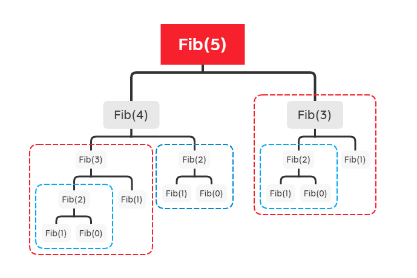
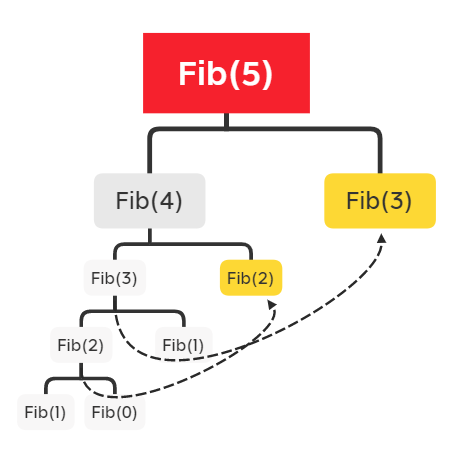

# 动态规划笔记

# 前言

在很久之前就已经听说过动态规划这个东西了，但是碍于~~懒~~的原因并没有认真啃完DP的课。最近开始刷LC之后又感觉到DP是不可丢失的一环，因此又去把这个东西捡了起来。

本文中，我过尽量简单的方式同各位分享一些DP的经典题目（尽量啦）。

# DP的定义与分类

DP，即动态规划。动态规划在查找有很多**重叠子问题**的情况的最优解时有效。它将问题重新组合成子问题。为了避免多次解决这些子问题，它们的结果都逐渐被计算并被保存，从简单的问题直到整个问题都被解决。因此，动态规划保存递归时的结果，因而不会在解决同样的问题时花费时间<sup>[1]</sup>。

DP大致上可以分为两种，分别为记忆化搜索(Memorization)以及建表(Tabulation)两种。

记忆化是对于递归解法的一种优化，通过加入memo字典存储每个递归部分的计算结果，在接下来的计算中首先检查字典中是否已经存储有结果，如果有则直接返回，以此减少计算量。记忆化不论是思考过程以及代码实现都相对简单，只需要在暴力解法的基础上加入记忆化的过程既可实现。

建表是对于迭代解法的一种优化，建表时，我们关心当前元素（或者当前几个元素一同）对之后元素的影响，并计算出之后元素的结果填入表中。在某些时候，建表方法比较复杂与困难，我们难以直接思考出转换方程，容易卡关。

# DP的经典例题

## 斐波拉契数列:

对于一个斐波拉契数列，我们有：
$$
\begin{align*}
\begin{split}
Fib(n) = \left \{
\begin{array}{ll}
    0,                            & n = 0\\
    1,     & n = 1\\
    Fib(n-2)+Fib(n-1),                                 & n >= 2
\end{array}
\right.
\end{split}
\end{align*}
$$
因此我们容易得到下面的暴力解法：

```python
class Solution:
    def fib(self, n: int) -> int:
        if n == 0:
            return 0
        if n < 2:
            return 1
        return self.fib(n - 1) + self.fib(n - 2)
```

以上的暴力解法在N较小的时候还可以使用，但是当N增大（经过本机验证大概是N=35）时用时非常感人。因此我们使用**记忆法**对其进行优化：

我们画出Fib()的函数递归调用树，如下图所示：



在图中，我们很容易发现有子树存在重复，如蓝色方框框柱的Fib(2)以及红色方框框柱的Fib(3)。既然我们再函数调用过程中发现了重复计算的过程，优化方式也十分简单：在计算过后将计算结果存入字典，并在下一次计算中事先检查字典是否已经有计算结果，如果有，则直接返回。经过以上优化，我们的函数递归调用变成了这样：其中黄色部分的函数计算将直接返回。



记忆化之后的代码实现如下：

```python
class Solution:
    self.memo = {}
    def fib(self, n: int) -> int:
        if n == 0:
            return 0
        if n < 2:
            return 1
        
        if n in self.memo:
            return self.memo[n]	# 2. 击中memo后直接返回
        
        self.memo[n] = self.fib(n - 1) + self.fib(n - 2)	# 1. 将计算结果存入memo字典
        
        return self.memo[n]
```

除了**记忆法**以外，我们也可以使用**建表**法来进行优化。

通过观察斐波拉契数列的定义表达式，我们可以发现Fib(n)由Fib(n - 1)和Fib(n - 2)来共同决定。只要我们事先计算了Fib(n - 1)和Fib(n - 2)，那么自然就可以计算出Fib(n)。（其实Fib(n) = Fib(n - 1) + Fib(n - 2)直接就是状态转移方程了）

```python
class Solution:
    def fib(self, n: int) -> int:
        if n == 0:  # 1. 确定base case
            return 0
        if n == 1:
            return 1

        dp = [0 for _ in range(n + 1)]  # 1.5 建表
        dp[0] = 0  # 确定初始值
        dp[1] = 1

        for i in range(2, n + 1):  # 2. 确定会变化的状态
            dp[i] = dp[i - 1] + dp[i - 2]  # 3. 确定选择，更新DP表

        return dp[n]  # 4. 得到答案
```

通过观察代码，我们可以发现与记忆法（基于递归）从上至下计算不同，建表法从下往上计算。但是，其实计算的方式与斐波拉契数列的表达方式并无不同，某种意义上也是基于暴力法基础上进行优化得来。由此可见，**要想写DP首先请一定要写出暴力解法**。

简单总结套路：

记忆法：

1. 以递归的方式写出暴力解法
2. 计算完毕后（立刻）将结果存入memo
3. 在函数开始判断memo是否已经有计算结果，如果有则立刻返回
4. （在LeetCode写记忆法时）每一次程序入口记得清空memo

# 引用

<div id="refer-anchor-1"></div>- [1] 维基百科编者. 动态规划[G/OL]. 维基百科, 2021(20210430)[2021-04-30]. https://zh.wikipedia.org/w/index.php?title=%E5%8A%A8%E6%80%81%E8%A7%84%E5%88%92&oldid=65417588.

<div id="refer-anchor-2"></div>- [2] labuladong. 动态规划套路详解.  https://leetcode-cn.com/problems/fibonacci-number/solution/dong-tai-gui-hua-tao-lu-xiang-jie-by-labuladong/

