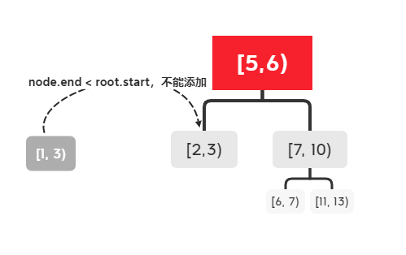

# LC刷题笔记-2021.7.22

#### [#150. Evaluate Reverse Polish Notation](https://leetcode-cn.com/problems/evaluate-reverse-polish-notation/)

Evaluate the value of an arithmetic expression in Reverse Polish Notation.

Valid operators are +, -, *, and /. Each operand may be an integer or another expression.

Note that division between two integers should truncate toward zero.

It is guaranteed that the given RPN expression is always valid. That means the expression would always evaluate to a result, and there will not be any division by zero operation.

 ```
 Example 1:
 
 Input: tokens = ["2","1","+","3","*"]
 Output: 9
 Explanation: ((2 + 1) * 3) = 9
 ```

### 思路：

看到题目中的Reverse首先联想到“栈”的数据结构，“栈”先进后出的数据结构可以方便我们进行逆序的操作。接着观察输入，我们可以发现当输入遇到运算符的时候即对前两个数字进行运算，并作为临时结果，直到表达式结束。

### 注意：

本题中有几个需要注意的地方：

1.   在进行“栈”的pop()操作的时候要判断对战是否为空，以免出错。但是由于在本题中已经确保表达式是Valid的，因此这部分判断可以省略。
2.   在将堆栈末尾的元素pop()的时候，要注意元素的先后顺序。第一个出栈的元素为减数/除数，第二个出栈的元素为被减数/被除数。
3.   需要注意Python中整除在遇到负数时的表现与题目不同：题目中6 / -132 = 0，而Python中6 / -132 = -1。

### 代码：

```python
class Solution:
    def evalRPN(self, tokens: List[str]) -> int:
        data = []
        operator = []

        for elem in tokens:
            if elem in {"+", "-", "*", "/"}:
                if len(data):  # 还是要验证一下data是否为空
                    data1 = data.pop()
                    data2 = data.pop()
                    if elem == "+":
                        data.append(data2 + data1)
                    elif elem == "-":
                        data.append(data2 - data1)
                    elif elem == "*":
                        data.append(data2 * data1)
                    elif elem == "/":  # 正常情况要验证除数是否为0，但是题目已经说过there will not be any division by zero operation，所以不验证
                        data.append(int(data2 / data1))  
                        # 注意用整除，同时先入栈的作为被除数，后入栈为除数
                        # 同时注意Python中，6 // -132 = 1，与Ex3不同，因此要特地写个判断
                        # 注意Python负数除法和题目表现不一致
            else:
                data.append(int(elem))
        return data[0] if data else "ERR"
```


## [#729. My Calendar I](https://leetcode-cn.com/problems/my-calendar-i/)

You are implementing a program to use as your calendar. We can add a new event if adding the event will not cause a double booking.

A double booking happens when two events have some non-empty intersection (i.e., some moment is common to both events.).

The event can be represented as a pair of integers start and end that represents a booking on the half-open interval [start, end), the range of real numbers x such that start <= x < end.

Implement the MyCalendar class:

-   MyCalendar() Initializes the calendar object.
-   boolean book(int start, int end) Returns true if the event can be added to the calendar successfully without causing a double booking. Otherwise, return false and do not add the event to the calendar.

```
Example 1:

Input
["MyCalendar", "book", "book", "book"]
[[], [10, 20], [15, 25], [20, 30]]
Output
[null, true, false, true]

Explanation
MyCalendar myCalendar = new MyCalendar();
myCalendar.book(10, 20); // return True
myCalendar.book(15, 25); // return False, It can not be booked because time 15 is already booked by another event.
myCalendar.book(20, 30); // return True, The event can be booked, as the first event takes every time less than 20, but not including 20.
```

### 注意：

1.   Python中tuple的大小比较方式为从两个tuple的第一个元素开始对比知道对比到第一个不相等的元素。

### 思路：

从题目中可知，一个有效的booking必须满足：该booking的开始时间大于上一个booking的结束时间，该booking的结束时间小于下一个booking的开始时间。

一个方法是遍历列表并逐个比较已经有的booking，这样做的复杂度为O(n)。我们可以使用二分查找树对此进行优化。我们定义这个二分查找树的左孩子开始时间小于根节点且有孩子开始时间大于根节点。

如输入的booking为[5, 6), [2, 3), [1,3), [7, 10), [6, 7), [11, 13)，则二分查找树为：



在普通情况下，复杂度可以降低到O(logN)，但在极端情况下如果节点只存在于右孩子，则复杂度将退化成O[n]。

### 代码：

```python
class Node:
    """
    平衡术树节点，左边小，又变大
    """
    __slots__ = 'start', 'end', 'left', 'right'

    def __init__(self, start, end):
        self.start = start
        self.end = end
        self.left = self.right = None

    def insert(self, node):
        """
        插入节点：
        反例：[1, 5), [7, 10), [5, 8)
        最后一个无法插入
        :param node:
        :return:
        """
        if node.start >= self.end:  # 开始晚于节点结束（Valid）
            if not self.right:  # 如果没有右孩子直接添加
                self.right = node
                return True
            return self.right.insert(node)  # 否则递归寻找
        elif node.end <= self.start:    # 结束早于节点开始（Valid）
            if not self.left:   # 如果没有左孩子直接添加
                self.left = node
                return True
            return self.left.insert(node)   # 否则递归查找
        else:
            return False


class MyCalendar(object):
    def __init__(self):
        self.root = None

    def book(self, start, end):
        if self.root is None:
            self.root = Node(start, end)
            return True
        return self.root.insert(Node(start, end))
```

### 另外一种解法

另外一种解法为使用sortedcontainer库的sortedlist来维持数组的有序性。

sortedlist中我们使用add()方法添加元素，使用sortedlist.bisect_left()来寻找第一个可以插入的元素（参考tuple的大小比较）。

在找到index之后，对比欲插入的元素以及其前后元素开始时间与结束时间来判断是否可以插入。

使用bisect_left()查找元素的复杂度大约是O(logn)

下面为bisect.bisect_left()的文档，与sortedlist.bisect_left()不同的是，前者需要手动维护列表的有序性，而后者将会自动维护。

```
bisect.bisect_left(a, x, lo=0, hi=len(a))
在 a 中找到 x 合适的插入点以维持有序。参数 lo 和 hi 可以被用于确定需要考虑的子集；默认情况下整个列表都会被使用。如果 x 已经在 a 里存在，那么插入点会在已存在元素之前（也就是左边）。如果 a 是列表（list）的话，返回值是可以被放在 list.insert() 的第一个参数的。

返回的插入点 i 可以将数组 a 分成两部分。左侧是 all(val < x for val in a[lo:i]) ，右侧是 all(val >= x for val in a[i:hi]) 。
```


### 代码

```python
from sortedcontainers import sortedlist


class MyCalendar(object):
    def __init__(self):
        self.s = sortedlist.SortedList()

    def book(self, start, end):
        event = (start, end)
        index = self.s.bisect_left(event)
        if index > 0 and start < self.s[index - 1][1] or index < len(self.s) and end > self.s[index][0]:
            # index > 0 和index < len(self.s) 用来防止数组越界
            # start < self.s[index - 1][1] 开始时间 < 上一个event的结束时间
            # end > self.s[index][0] 结束时间 > （插入后的下一个）event的开始时间
            return False
        else:
            self.s.add(event)
            return True
```

