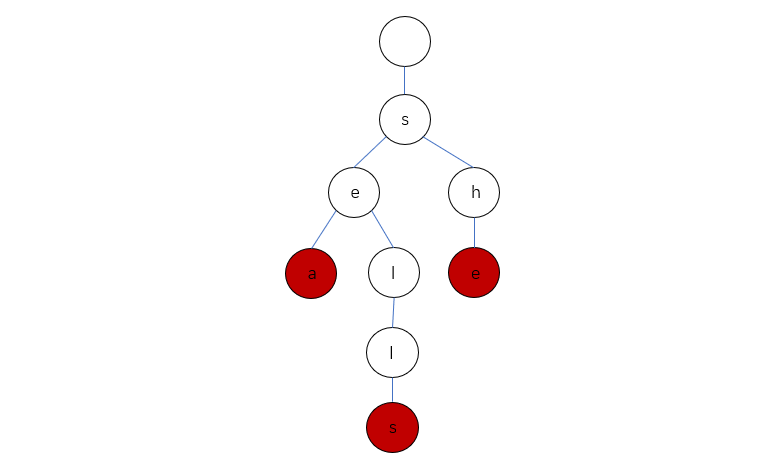
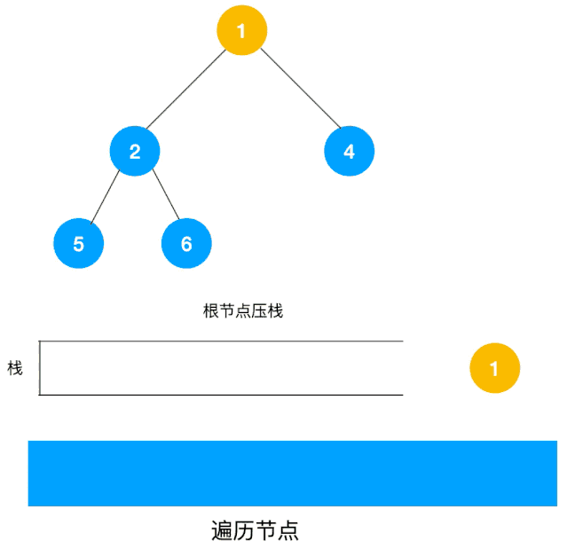

# DFS专题笔记（2021.5.24-2021.5.30）

## Leetcode题目序号：

- \#200 Number of Islands
-  \#695 Max Area of Island
- \#394 Decode String
- \#547 Number of Provinces
- \#207 Course Schedule
- \#210 Course Schedule II （Same as #207）
- \#211 Design Add and Search Words Data Structure
- #863 All Nodes Distance K in Binary Tree
- \#526 Beautiful Arrangement
- #934 Shortest Bridge

## 数据结构

### 树的数据结构

在谈到树的时候我们一般指的是二叉树，其主要的数据结构如下

```python
class TreeNode:
    def __init__(self, x):
        self.val = x
        self.left = None
        self.right = None
```

其中包括了val数据域，left，right两个子节点。

当然了，还有不典型的二叉树，如#863 All Nodes Distance K in Binary Tree中，通过新增该节点的父节点，就有多种不同的子节点，如：

```python
class TreeNode:
    def __init__(self, x):
        self.val = x
        self.left = None
        self.right = None
        self.par = None
```

对于不同的节点在递归中增加几行就可以全部遍历了。

#### 字典树

Trie树，即字典树，又称单词查找树或键树，是一种树形结构，是一种哈希树的变种。

字典树的实现：https://leetcode-cn.com/problems/implement-trie-prefix-tree/solution/trie-tree-de-shi-xian-gua-he-chu-xue-zhe-by-huwt/




### 树的遍历

树的遍历主要有两种算法，分别为深度优先遍历DFS以及广度优先遍历BFS（虽然本专题是DFS ，但是BFS也顺带提一下）：

DFS多采用递归、堆栈方式实现（其实递归内部就维护了一个堆栈）。

```python
def traverse(node):
    if node.data:	#basecase，如果节点为空
      return -1
  
  	node.data
  	traverse(node.lchild)
  	traverse(node.rchild)

```

递归方式的遍历顺序：


使用栈的方式进行遍历：



<!--Source: https://developer.51cto.com/art/202004/614590.htm-->

需要注意的是：由于堆栈先进后出的结构，我们需要先对右孩子压栈，这样当出栈的时候才是左孩子先出栈。

BFS多采用队列方式实现。

```python
def BFS(node):
  queue = collections.deque()
  queue.append(node)
  while !queue:	#basecase
    node = queue.leftpop()
    node.data
    queue.append(node.lchild)
    queue.append(node.rchild)
```


### 图

关于图有许多的概念，如果记不起来请自己去翻数据结构，本文主要着重在图的遍历。

图与二叉树的不同主要为三方面：

1. 二叉树本质上是一个无向无环图，在遍历时不会进入死循环一直绕圈，但是图中可能会存在环路
2. 二叉树中只有左孩子和右孩子两个子节点，而图中相连节点数量未定。
3. 二叉树中各节点间没有“方向”，而图根据类型可能会有方向。

### 图的遍历

图的遍历与树的遍历类似，在树的遍历基础上：

1. 引入visited数组存放已经遍历过的节点并在basecase中判断节点是否已经访问过。
2. 在遍历时遍历所有子节点而不仅仅是左右孩子。

## 题解：

#### [200. Number of Islands](https://leetcode-cn.com/problems/number-of-islands/)

```
Given an m x n 2D binary grid grid which represents a map of '1's (land) and '0's (water), return the number of islands.

An island is surrounded by water and is formed by connecting adjacent lands horizontally or vertically. You may assume all four edges of the grid are all surrounded by water.
Example 1:

Input: grid = [
  ["1","1","1","1","0"],
  ["1","1","0","1","0"],
  ["1","1","0","0","0"],
  ["0","0","0","0","0"]
]
Output: 1
Example 2:

Input: grid = [
  ["1","1","0","0","0"],
  ["1","1","0","0","0"],
  ["0","0","1","0","0"],
  ["0","0","0","1","1"]
]
Output: 3
 

Constraints:
m == grid.length
n == grid[i].length
1 <= m, n <= 300
grid[i][j] is '0' or '1'.


```

##### 思路：

本题有两个需要注意的点：

1. 需要判断下标是否越界
2. 需要统计岛屿个数（即计算进行了DFS的次数）

##### 解题步骤（DFS）：

1. 首先找到一块陆地$grid[x][y] == 1$，并开始深度优先搜索
2. 开始搜索前，首先判断是否越界，如果未越界且未访问则进行搜索，否则return
3. 搜索的时候首先对$grid[x][y]=2$，表明节点已经遍历，并对上下左右四个节点进行递归
4. 当第一次DFS搜索之后，岛屿所有地区的值$grid[x][y]==2$，同时计数器+=1
5. 重复直到搜索所有岛屿

```python
class Solution:
    def numIslands(self, grid: List[List[str]]) -> int:
        def isInArea(grid, x, y):
            if (x >= 0 and x < len(grid) and
                y >= 0 and y < len(grid[0])):  #判断是否越界
                return True
            else:
                return False
        
        def dfs(grid, x, y):	
            if not isInArea(grid, x ,y):
                return  #判断越界
            if grid[x][y] != "1":   
                #如果该地区不是陆地（包括0，以及2已经便利过的情况）
                #还有注意数据类型是str还是int
                return
            grid[x][y] = "2"	#对途中访问过的节点添加到visited中
            dfs(grid, x + 1, y)
            dfs(grid, x - 1, y)
            dfs(grid, x, y + 1)
            dfs(grid, x, y - 1)

        count = 0
        for x in range(len(grid)):  #获取grid长度
            for y in range(len(grid[0])):   #获取grid宽度
                if grid[x][y] == "1":
                    count += 1
                    dfs(grid, x, y)
        return count
```

##### 解题步骤（BFS）：

1. 首先找到一块陆地$grid[x][y] == 1$，初始化队列q，并开始广度优先搜索
2. 判断陆地$grid[x][y]$上下左右子节点是否越界，同时是否已经访问过。如果为否，将$grid[x][y]=2$，上下左右子节点加入队列。
3. 重复第二步直到队列为空，则完成一个岛屿的搜索。

#### [695. Max Area of Island](https://leetcode-cn.com/problems/max-area-of-island/)

```
You are given an m x n binary matrix grid. An island is a group of 1's (representing land) connected 4-directionally (horizontal or vertical.) You may assume all four edges of the grid are surrounded by water.

The area of an island is the number of cells with a value 1 in the island.

Return the maximum area of an island in grid. If there is no island, return 0.

Example 1:

Input: grid = [[0,0,1,0,0,0,0,1,0,0,0,0,0],[0,0,0,0,0,0,0,1,1,1,0,0,0],[0,1,1,0,1,0,0,0,0,0,0,0,0],[0,1,0,0,1,1,0,0,1,0,1,0,0],[0,1,0,0,1,1,0,0,1,1,1,0,0],[0,0,0,0,0,0,0,0,0,0,1,0,0],[0,0,0,0,0,0,0,1,1,1,0,0,0],[0,0,0,0,0,0,0,1,1,0,0,0,0]]
Output: 6
Explanation: The answer is not 11, because the island must be connected 4-directionally.
```


##### 思路

1. 与#200类似，需要判断是否越界
2. 在DFS遍历中，需要计算相邻的节点。（有点像计算一个二叉树的深度）

##### 解题步骤（DFS）：

1. 首先找到一块陆地$grid[x][y]==1$并开始深度优先搜索。
2. 在搜索前，先判断是否越界，是否访问过，如果是则返回0（表明这个节点不是有效的或已经访问过不再重复计算）。否则，对上下左右节点进行深度优先遍历。
3. DFS：搜索的时候首先置节点$grid[x][y]=2$表明已经进行搜索，同时令count=1（表明该节点有效，会在return后加入到上一层的count中），并在count中加入上下左右子节点DFS统计的count个数。直到该岛屿全部统计完成，return统计面积。
4. 将岛屿最大的面积与步骤3中统计面积进行比较，return较大值。

```python
class Solution:
    def maxAreaOfIsland(self, grid: List[List[int]]) -> int:

        def isInArea(grid, x, y):
            """
            判断是否在区域内
            """
            if x >= 0 and x < len(grid) and y >= 0 and y < len(grid[0]):
                return True
            else:
                return False

        def dfs(grid, x, y):
            """
            DFS遍历
            """
            if not isInArea(grid, x ,y):
                return 0 #判断越界
            if grid[x][y] != 1:   
                # 如果该地区不是陆地（包括0，以及2已经便利过的情况）
                # ！！！！还有注意数据类型是str还是int！！！！
                return 0
            grid[x][y] = 0
            space_count = 1
            space_count += dfs(grid, x + 1, y)
            space_count += dfs(grid, x - 1, y)
            space_count += dfs(grid, x, y + 1)
            space_count += dfs(grid, x, y - 1)
            return space_count

        max_space = 0
        for x in range(len(grid)):
            for y in range(len(grid[0])):
                if grid[x][y] == 1:
                    max_space = max(max_space, dfs(grid, x, y))
        return max_space
```


##### 解题步骤（BFS）：

1. 首先找到一块陆地$grid[x][y]==1$，初始化队列q，计数变量count=1，并开始进行广度优先搜索。
2. 在搜索前，先判断是否越界，是否访问过，如果是则return。否则开始搜索
3. 搜索时先置$grid[x][y]=2$，将上下左右节点送进队列。
4. 当队列不为空时，重复进行广度优先搜索，每出栈一次则$count+=1$
5. 比较最大值与当前返回值，取较大者。

#### [394. Decode String](https://leetcode-cn.com/problems/decode-string/)

```
Given an encoded string, return its decoded string.

The encoding rule is: k[encoded_string], where the encoded_string inside the square brackets is being repeated exactly k times. Note that k is guaranteed to be a positive integer.

You may assume that the input string is always valid; No extra white spaces, square brackets are well-formed, etc.

Furthermore, you may assume that the original data does not contain any digits and that digits are only for those repeat numbers, k. For example, there won't be input like 3a or 2[4].


Example 1:
Input: s = "3[a]2[bc]"
Output: "aaabcbc"
Example 2:
Input: s = "3[a2[c]]"
Output: "accaccacc"
```

##### 思路

这题主要是注意几个点：

1. 前方数字可能不止一位，如本题取值范围是[1,300] 
2. 当一层括号时，结果为子串 * 系数；当多层括号时，先对最里面的子串进行操作，然后再对外面一层的子串进行操作在数据结构上类似堆栈。

##### 解题步骤（堆栈）：

1. 构建辅助栈 stack， 遍历字符串 s 中每个字符 c；

    - 当 c 为数字时，将数字字符转化为数字 multi，用于后续倍数计算；
    - 当 c 为字母时，在 res 尾部添加 c；
    - 当 c 为 [ 时，将当前 multi 和 res 入栈，并分别置空置 00：
        - 记录此 [ 前的临时结果 res 至栈，用于发现对应 ] 后的拼接操作；
        - 记录此 [ 前的倍数 multi 至栈，用于发现对应 ] 后，获取 multi × [...] 字符串。
        - 进入到新 [ 后，res 和 multi 重新记录。
    - 当 c 为 ] 时，stack 出栈，拼接字符串 res = last_res + cur_multi * res，其中:  last_res是上个 [ 到当前 [ 的字符串，例如 "3[a2[c]]" 中的 a；  cur_multi是当前 [ 到 ] 内字符串的重复倍数，例如 "3[a2[c]]" 中的 2。
2. 返回字符串 res。

```python
class Solution:
    def decodeString(self, s: str) -> str:
        """
        思路：
        1. 题目中提到括号，那么明显可以使用堆栈方式处理
        2. []之间为一个栈的元素
        3. 注意multiplier是两位数的情况

        堆栈结构
        [    , c ]
        [   2, a ]
        [   3, '']
        """
        stack, res, multi = [], "", 0
        for c in s:
            if c == '[':    
                #当左括号的时候push，其实这里貌似只push了multiplier
                #在最后做乘法的时候直接乘以后面整个括号
                #再入栈之后要清空buffer
                stack.append([multi, res])
                res, multi = "", 0
            elif c == ']':
                #当有括号时候pop
                cur_multi, pre_res = stack.pop()
                # 字符串为前面的字符串 + 当前字符串 * 系数
                res = pre_res + cur_multi * res
            elif '0' <= c <= '9':
                #当数字为23的时候先扫描到2然后再扫描到3，因此要把2和3组合起来
                multi = multi * 10 + int(c) 
            else:
                res += c    #其他情况下延长res
        return res
```

##### 解题步骤（递归）：

总体思路与辅助栈法一致，不同点在于将 [ 和 ] 分别作为递归的开启与终止条件：

- 当 s[i] == ']' 时，返回当前括号内记录的 res 字符串与 ] 的索引 i （更新上层递归指针位置）；
- 当 s[i] == '[' 时，开启新一层递归，记录此 [...] 内字符串 tmp 和递归后的最新索引 i，并执行 res + multi * tmp 拼接字符串。
    遍历完毕后返回 res。

```python
class Solution:
    def decodeString(self, s: str) -> str:
        """
        思路：（递归解法）
        1. 使用[作为开始标志，]作为结束标志
        2. 当 s[i] == '[' 时，开启新一层递归，记录此 [...] 内字符串 tmp 和递归后的最新索引 i，并执行 res + multi * tmp 拼接字符串。
        """
        def dfs(s, i):
            res, multiplier = "", 0
            while i < len(s):
                if s[i] == "]": #如果遇到递归结束标志
                    return i, res #返回当前已经处理完的子串的坐标，不用重复遍历
                elif s[i] == "[":   #如果遇到递归开始标志
                    i, next_sub_res = dfs(s, i + 1)   #从下一位开始递归
                    res = res + multiplier * next_sub_res    #子串*multiplier
                    multiplier = 0 #在完成一个子串吼multiplier要置0，不然会重复
                elif "0" <= s[i] <= "9":
                    multiplier = 10 * multiplier + int(s[i]) #考虑两位数
                else:
                    res += s[i] #正常字符串这相加就好
                i += 1  #loop内index自增
            return res  #返回最后拼接完成的字符串
        return dfs(s, 0)    #程序的入口
```

##### Credit：

https://leetcode-cn.com/problems/decode-string/solution/decode-string-fu-zhu-zhan-fa-di-gui-fa-by-jyd/

#### [547. Number of Provinces](https://leetcode-cn.com/problems/number-of-provinces/)

```
There are n cities. Some of them are connected, while some are not. If city a is connected directly with city b, and city b is connected directly with city c, then city a is connected indirectly with city c.

A province is a group of directly or indirectly connected cities and no other cities outside of the group.

You are given an n x n matrix isConnected where isConnected[i][j] = 1 if the ith city and the jth city are directly connected, and isConnected[i][j] = 0 otherwise.

Return the total number of provinces.

```

Example 1:

Input: isConnected = [[1,1,0],[1,1,0],[0,0,1]]
Output: 2
Example 2:

Input: isConnected = [[1,0,0],[0,1,0],[0,0,1]]
Output: 3

##### 思路：

与#200和#695十分相似，重点是要处理数据结构的不同，如树的数据结构为链表（应该吧）而图的数据结构为邻接矩阵。因此在该图中，两者有链接的表示应为$isConnected[x][y]==1$

##### 解题步骤（DFS）：

思路同#200

```python
class Solution:
    def findCircleNum(self, isConnected: List[List[int]]) -> int:
        def dfs(isConnected, i, visited):
            for j in range(cities):
                if (isConnected[i][j] == 1 and j not in visited):
                    visited.add(j)
                    dfs(isConnected, j, visited)
            
        visited = set()	#已经遍历过的节点
        cities = len(isConnected)	#城市数量
        province = 0

        for i in range(cities):	#遍历所有城市
            if i not in visited:	#如果城市没有被遍历过
                province += 1	#省份+1（单独一个城市也可能成为省份）
                dfs(isConnected, i, visited)	#将所有相邻的城市都遍历一次
        return province	#省份数量
```

##### 解题步骤（BFS）：

```python
#BFS
class Solution:
    def findCircleNum(self, isConnected: List[List[int]]) -> int:
        cities = len(isConnected)
        visited = set()
        province = 0
        
        for i in range(cities): #选择一个城市
            if i not in visited:    #如果城市没有被访问过
                Q = collections.deque([i])  #添加到队列
                while Q:    #当队列不为空时
                    j = Q.popleft() #选择队列头的城市出队列（准备访问）
                    visited.add(j)  #访问过后
                    for k in range(cities): #选择J城市为起点开始访问
                        if isConnected[j][k] == 1 and k not in visited:
                            Q.append(k) #把访问到与J城市相连的K城市加入队列准备访问
                    #直到队列清空后所有相连的城市访问完毕
                province += 1
        return province
```

#### [207. Course Schedule](https://leetcode-cn.com/problems/course-schedule/)

```
There are a total of numCourses courses you have to take, labeled from 0 to numCourses - 1. You are given an array prerequisites where prerequisites[i] = [ai, bi] indicates that you must take course bi first if you want to take course ai.

For example, the pair [0, 1], indicates that to take course 0 you have to first take course 1.
Return true if you can finish all courses. Otherwise, return false.


Example 1:

Input: numCourses = 2, prerequisites = [[1,0]]
Output: true
Explanation: There are a total of 2 courses to take. 
To take course 1 you should have finished course 0. So it is possible.
Example 2:

Input: numCourses = 2, prerequisites = [[1,0],[0,1]]
Output: false
Explanation: There are a total of 2 courses to take. 
To take course 1 you should have finished course 0, and to take course 0 you should also have finished course 1. So it is impossible.
 

Constraints:

1 <= numCourses <= 105
0 <= prerequisites.length <= 5000
prerequisites[i].length == 2
0 <= ai, bi < numCourses
All the pairs prerequisites[i] are unique.


来源：力扣（LeetCode）
链接：https://leetcode-cn.com/problems/course-schedule
著作权归领扣网络所有。商业转载请联系官方授权，非商业转载请注明出处。
```


##### 思路：

拓扑排序主要思想：依次去除前置节点

本题的主要思路为判断该图是否有环路，例如在深度优先遍历中，如果遍历到的节点在之前已经遍历过，则可以认为该图有环路，因此输出为结果为False。当节点中不存在环路时，DFS在遍历到最后的叶子节点时，将叶子节点加入排序列表中即可。

##### 解题步骤（Kaln算法，施工中）：

##### 解题步骤（DFS）：

1. 新建一个字典存储每个节点出度（邻接表），visited列表存储遍历标识，result列表存储排序结果，valid表示排序结果是否有效。新建字典时使用```collections.defaultdict(list)```防止后面 ```edges[pre].append(cur)```时的index error。
2. 邻接表中按{先修课: [后修课1，2，3]}进行构建
3. 对于所有的节点进行DFS
4. DFS之前先判断valid是否有效，并且节点是否访问过。如果访问过则说明有环路，valid置为false，直接return False.
5. 开始DFS首先将节点visited置1，随后递归调用DFS搜索节点的相邻节点。当递归到叶子节点时（该节点已经没有先修课），将该节点visited置2说明完成遍历，同时该节点加入result
6. 重复完成所有节点后，return result

```python
class Solution:
    def findOrder(self, numCourses: int, prerequisites: List[List[int]]) -> List[int]:
        edges = collections.defaultdict(list)   #新建一个空字典存储边
        visited = [0 for _ in range(numCourses)]    #新建一个visited数组用于存储遍历情况
        """
        visited:
        0: 未遍历
        1：遍历中
        2：已完成
        """
        result = list() #拓扑排序结果
        valid = True

        for cur,pre in prerequisites:
            #the pair [0, 1], indicates that to take course 0 you have to first take course 1.
            edges[pre].append(cur)

        def dfs(u):
            nonlocal valid
            visited[u] = 1  #将节点标记为搜索中
            for v in edges[u]:
                """
                搜索相邻节点
                发现有环路则立刻停止
                """
                for v in edges[u]:
                    if visited[v] == 0: #如果下一节点未搜索则搜索该节点
                        dfs(v)
                        if not valid:   #如果任何时候发现not valid则退出
                            return #这里只能return回上一层，所以在程序末尾还要进行一次return
                    elif visited[v] == 1:   #base case 当发现搜索中的节点则找到了环
                        valid = False
                        return 
            visited[u] = 2  #搜索完成后把节点置为已完成
            result.append(u)    #将完成搜索的节点入栈

        for i in range(numCourses):
            if valid and not visited[i]:
                dfs(i)

        if not valid:
            return []
        # 如果没有环，那么就有拓扑排序
        # 注意下标 0 为栈底，因此需要将数组反序输出
        return result[::-1]
```

#### [210. Course Schedule II](https://leetcode-cn.com/problems/course-schedule-ii/)

Same as #207

#### [211. Design Add and Search Words Data Structure](https://leetcode-cn.com/problems/design-add-and-search-words-data-structure/)

Design a data structure that supports adding new words and finding if a string matches any previously added string.

Implement the WordDictionary class:

WordDictionary() Initializes the object.
void addWord(word) Adds word to the data structure, it can be matched later.
bool search(word) Returns true if there is any string in the data structure that matches word or false otherwise. word may contain dots '.' where dots can be matched with any letter.

```
Example:

Input
["WordDictionary","addWord","addWord","addWord","search","search","search","search"]
[[],["bad"],["dad"],["mad"],["pad"],["bad"],[".ad"],["b.."]]
Output
[null,null,null,null,false,true,true,true]

Explanation
WordDictionary wordDictionary = new WordDictionary();
wordDictionary.addWord("bad");
wordDictionary.addWord("dad");
wordDictionary.addWord("mad");
wordDictionary.search("pad"); // return False
wordDictionary.search("bad"); // return True
wordDictionary.search(".ad"); // return True
wordDictionary.search("b.."); // return True
```


##### 思路：

字典树定义见数据结构-树的数据结构-字典树

添加：在根节点开始遍历，如果遍历到节点不存在，则创建节点，节点创建完成后，添加end标志。

搜索：在根节点处开始进行深度优先遍历，对于遇到通配符"."的情况则对所有的子节点进行深度优先遍历，寻找匹配。

##### 解题方法

1. 当调用 addWord()方法时：

    遍历字符串单词 word，若当前遍历的字符在前缀树的 children[26] 中对应位置为空，即 node.children[ch] == null，此时需要再该位置上定义一个 Trie() 表示这个位置已经有了字符，即 node.children[ch] = new Trie()。

    在将 wordword 全部遍历完时退出循环后，将该字符串最后一个位置上的字符的 isEndisEnd 设置为 truetrue 表示该字符串在这里结束了。

2. 当调用 search() 方法时：

    若当前遍历的字符不是 ' . ' 并且该位置上也没有 TrieTrie 节点，则说明该单词不在树中，直接返回 falsefalse。

    若当前遍历的字符是 ' . '，需要继续遍历 node.children[26] 对该节点所有不为空的节点进行深度搜索，如果存在下一个字母，则从下一个字母开始再继续做检查，该过程深入几层后，可能存在不满足情况，此时需要回溯，所以最好采用递归。

```python
class WordDictionary:

    def __init__(self):
        """
        Initialize your data structure here.
        """
        self.d = {}         #字典树
        """
        字典数d的数据结构主要包括：
        bool(isEnd): 标志本节点是否为末尾节点
        dict(d): 下一节点，数据类型同样为字典树，使用字典的形式保存其子节点
        """
        

    def addWord(self, word: str) -> None:
        t = self.d    #指定字典树
        for c in word:  #遍历需要添加的单词中的每一个字母
            if c not in t:  #如果遍历的子节点没有匹配到
                t[c] = {}   #开辟新的节点（记住：新的节点也是字典树）
            t = t[c]    #将当前节点移到子节点
        t['end'] = True #标志加入单词结束

    def search(self, word: str) -> bool:
        cut = False
        def f(td, s):       #深搜，参数为：当前字典树，当前串
            nonlocal cut
            if cut:         #剪枝，如果已经搜索到末尾
                return True
            t = td
            for i, c in enumerate(s):
                if c == '.':    #处理通配符
                    # return any(f(t[j], s[i + 1: ]) for j in t if j != 'end')    #深搜扩展
                    #这是上面那一行公司的拓展版本
                    for j in t: #对于该节点的所有字符
                        if j != 'end':  #如果该字符不是结束支付
                            if f(t[j], s[i + 1 :]): #从该子节点字典树开始搜索单词
                                return True
                    return False
                if c not in t:  #如果C不在字典树中，则匹配失败
                    return False
                t = t[c]    #移到下一个子节点
            cut = 'end' in t    #以end表示单词结束
            return cut
        return f(self.d, word)  #程序入口：从根节点开始深度优先搜索


# Your WordDictionary object will be instantiated and called as such:
# obj = WordDictionary()
# obj.addWord(word)
# param_2 = obj.search(word)

```

##### Credit:

https://leetcode-cn.com/problems/design-add-and-search-words-data-structure/solution/tian-jia-yu-sou-suo-dan-ci-shu-ju-jie-go-typn/

#### [863. All Nodes Distance K in Binary Tree](https://leetcode-cn.com/problems/all-nodes-distance-k-in-binary-tree/)

We are given a binary tree (with root node root), a target node, and an integer value k.

Return a list of the values of all nodes that have a distance k from the target node.  The answer can be returned in any order.

```
Input: root = [3,5,1,6,2,0,8,null,null,7,4], target = 5, k = 2

Output: [7,4,1]

Explanation: 
The nodes that are a distance 2 from the target node (with value 5)
have values 7, 4, and 1.

```


Note that the inputs "root" and "target" are actually TreeNodes.
The descriptions of the inputs above are just serializations of these objects.


Note:

The given tree is non-empty.
Each node in the tree has unique values 0 <= node.val <= 500.
The target node is a node in the tree.
0 <= k <= 1000.

##### 思路

本题只要维护所有节点的父节点，即可将任意节点的距离问题改为距离根节点的距离问题。

##### 解题方法


```python
# Definition for a binary tree node.
# class TreeNode:
#     def __init__(self, x):
#         self.val = x
#         self.left = None
#         self.right = None

class Solution(object):
    def distanceK(self, root, target, K):
        """
        实现思路
        1. 对所有节点添加上父节点
        2. 从target node开始进行广度优先遍历，并设置好相邻节点的distance
        3. 匹配并且输出所有相邻节点的distance
        """
        def dfs(node, par = None):  #在初始条件下par为None
            if node:
                node.par = par  #为节点添加父节点
                dfs(node.left, node)    #深度优先遍历
                dfs(node.right, node)

        dfs(root)   #为节点添加父节点（入口）

        queue = collections.deque([(target, 0)])    #新建一个双向队列
        visited = {target} #存储已经遍历过的节点
        """
        其实感觉下面有一点类似树的广度优先遍历
        通过队列遍历节点
        并且在节点有neighbour时队列+1
        """
        while queue:    #当队列不为空时（遍历没完成）,对所有队列中的节点
                        #queue(node, distance)
            if queue[0][1] == K:    #如果节点距离为K
                return [node.val for node, d in queue]	#返回节点的值
            node, d = queue.popleft() #遍历完成
            for nei in (node.left, node.right, node.par):   #对该节点所有的neighbor进行遍历（neighbor包括左孩子右孩子以及我们维护上去的父节点）
                if nei and nei not in visited: #如果neighbor没有遍历到
                    visited.add(nei)   #添加到visited中
                    queue.append((nei, d+1))    #将距离添加到队列中

        return []
```

##### Credit


